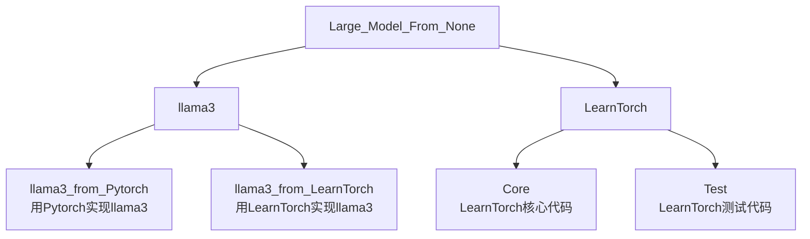

# 从零实现大模型/Large_Model_From_None

## 0.项目介绍/Intro  
我们要实现的最终项目如下图所示：


<!-- 
```
Large_Model_From_None
    ├─llama3
        ├─llama3_from_Pytorch    #用Pytorch实现llama3
        ├─llama3_from_LearnTorch    #用LearnTorch实现llama3
    └─LearnTorch
        ├─Core                  #LearnTorch核心代码
        ├─Test                  #LearnTorch测试代码
```
-->




## 1.自制深度学习框架/LearnTorch  


## 2.虚拟私人助手/VirtualAssistant  
