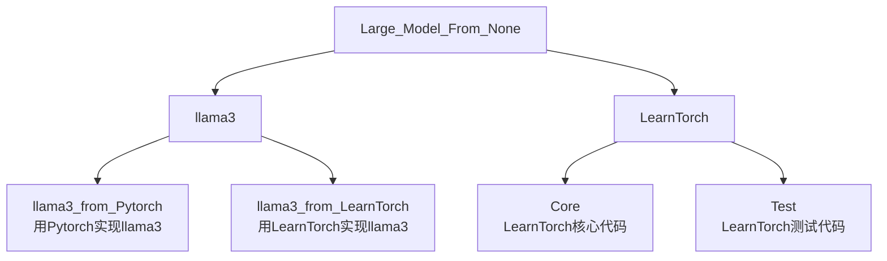
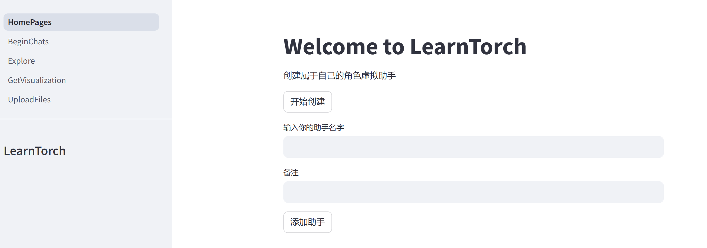

# 从零实现大模型/Large_Model_From_None

## 0.项目介绍/Intro  
我们要实现的最终项目如下图所示：


<!-- 
```
Large_Model_From_None
    ├─llama3
        ├─llama3_from_Pytorch    #用Pytorch实现llama3
        ├─llama3_from_LearnTorch    #用LearnTorch实现llama3
    └─LearnTorch
        ├─Core                  #LearnTorch核心代码
        ├─Test                  #LearnTorch测试代码
```
-->




## 1.自制深度学习框架/LearnTorch  
<br/><br/><br/><br/>
<div align=center>


</div><br/><br/><br/>

### (1)自动微分

<div align="center">
        
        
</div>
=======

</div><br/><br/><br/>

### (1)可视化计算图
<br/>


### (2)可视化梯度下降
<br/>

https://github.com/user-attachments/assets/d8e18c83-ecdb-48ce-acb7-a6d6183c1d7b


### (2)可视化计算图


### (3)可视化梯度下降


<br/>

## 2.虚拟私人助手/VirtualAssistant  

### (1)自定义助手模型
<br/>



=======


w
