# 从零实现大模型/Large_Model_From_None

<br/>

## 0.环境安装和项目启动 

<br/>

##### 项目启动：进入到 VirtualAssistant目录，运行以下代码

<!-- 

```代码语言
streamlit run Stream_litapps.py
```

-->

<br/>

## 1.项目介绍/Intro  
我们要实现的最终项目如下图所示：


<!-- 

```
Large_Model_From_None
	├─imgs
    └─LearnTorch_ALL
        ├─LearnTorch
        ├─Llama3
        ├─TeachImage
        ├─Test
    └─prototypes
    └─VirtualAssistant
        ├─imgs            
        ├─LLM         
        ├─model_finetuning
        ├─Pages
```
-->

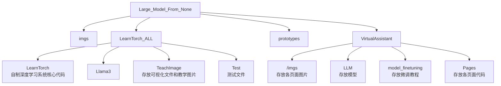


## 1.自制深度学习框架/LearnTorch  
<br/><br/><br/><br/>

<div align=center>

</div><br/><br/><br/>

### (1)自动微分

<div align="center">
        
        
</div>

### (2)可视化计算图


### (2)可视化学习率和迭代次数
#### (2.1)优化慢

<div align="center">
	
</div>

#### (2.2)优化速度快

<div align="center">
	
</div>

#### (2.3)反复震荡
<div align="center">
	
</div>

### (3)可视化梯度下降
#### (3.1) 梯度下降优化对比牛顿法优化


#### (3.2)线性回归梯度下降优化可视化
<div align="center">

</div>

<div align="center">

</div>

#### (3.3)神经网络线性回归梯度下降优化可视化
##### (3.3.1)欠拟合

<div align="center">

</div>

##### (3.3.2)良好拟合

<div align="center">

</div>

##### (3.3.3)过拟合

<div align="center">

</div>


## 2.虚拟私人助手/VirtualAssistant  

### (0)虚拟私人助手介绍

#### 本项目实现的LearnTorch主要分为自制深度学习系统和虚拟助手系统，旨在以可视化和实践的方式实现，而虚拟私人助手将以上两个系统同时结合起来，通过使用虚拟私人助手，你不仅可以学习深度学习本质，深入理解深度学习框架的核心技术，还可以上手大模型，接触最新的大模型成果！！！

<br/>


### (1)数据可视化

**在数据可视化中，不仅提供了许多可视化图片以及动图，还提供了动手试一试的功能，让你能够亲自动手体验调参带来的快乐！**

#### 1.1 计算图可视化

##### 在如今导数广泛应用于现代科学技术，特别是人工智能领域，导数起着核心作用，而求导更是属于导数中起到至关重要的一部分，所以在此部分我们将具体介绍如何进行反向传播，通过一些从简单到复杂的计算图来帮助我们更加深入的了解反向传播的过程！

<br/>

<div align="center">
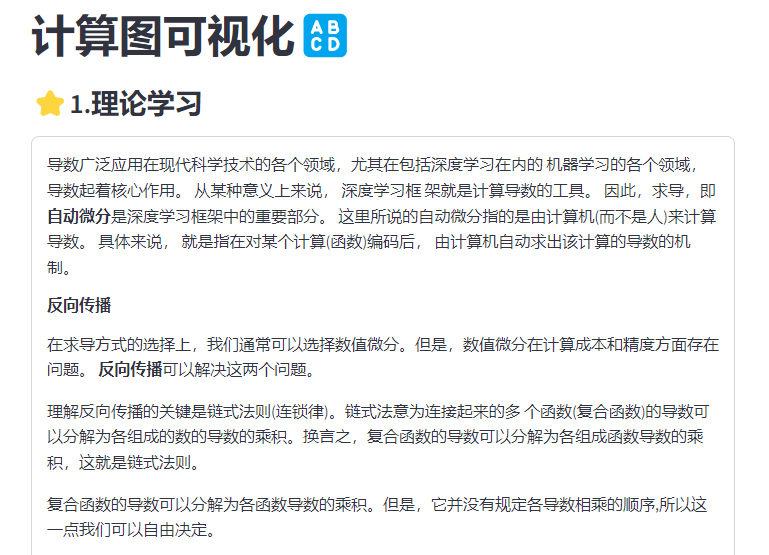
</div>

#### 1.2 学习率和迭代次数可视化

##### 在深度学习中，学习率（learning rate, lr）和迭代次数（iterations, iters）是一对非常关键的超参数！通过**虚拟私人助手**提供的可视化学习率和迭代功能，帮助你成为深度学习超参数调节的高手，充分理解它们的具体含义！

<br/>

<div align="center">
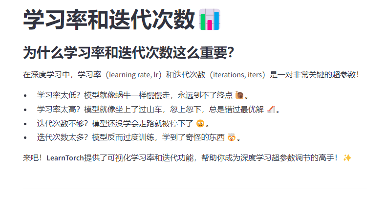
</div>

#### 1.3 梯度下降可视化

##### 梯度下降是利用一阶导数来优化模型，是深度学习**训练**的**主要过程**。而梯度下降它的目标是找到使损失函数最小的参数，从而帮助训练达到最优化！通过学习梯度下降可视化，帮助你训练出属于自己的完美模型！

<br/>

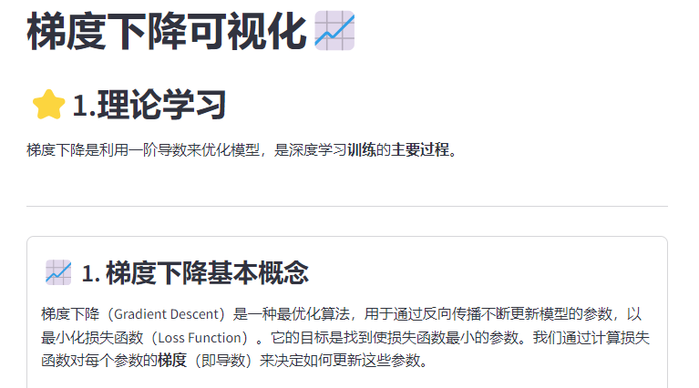


### (2)大模型教程

**在此部分，虚拟私人助手提供了不同的四个教程，分别是CUDA pytoch环境安装教程，低参数大模型测评，魔搭社区以及colab微调教程，四个部分可以不同程度的帮助你了解最新的大模型以及对其的微调过程**

#### 2.1 CUDA pytoch环境安装教程

##### 首先是在本地对 cuda 和 pytorch 进行安装的教程，通过安装这两个最重要的部分，就可以在下载需要的软件包后，执行大部分的python代码了！

<br/>

<div align="center">
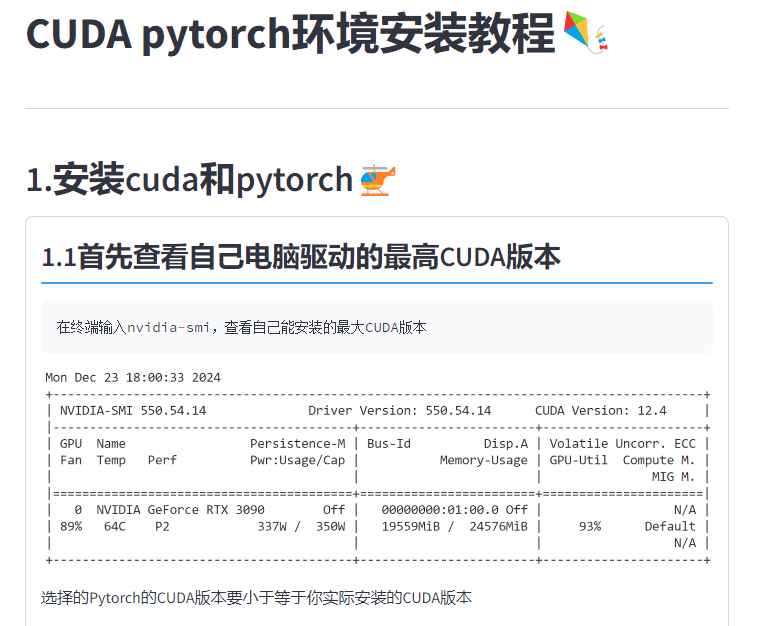
</div>


#### 2.2 低参数大模型测评

##### 在低参数大模型测评中，我们主要测试了三款模型，分别是Qwen2.5-3B-instruct，Qwen2.5-3B-coder和LLama3.2B-instruct，测试的内容从模型参数到模型种类以及模型测评都有较为清晰的介绍，通过了解这部分，可以帮助你选择更加适合你的大模型！

<br/>

<div align="center">
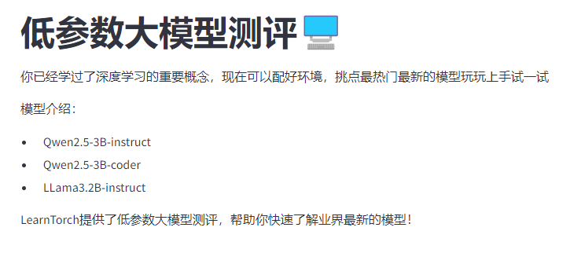
</div>

<br/>

#### 2.3 魔搭社区以及colab微调教程

##### 这个部分属于最有趣的部分啦！通过学习我们撰写的微调教程，可以非常快速的实现一个属于我们自己的大模型（我们同时也提供了一些数据集资源，大家可以下载来进行训练），在云端进行训练，不仅解决了我们大部分人没有gpu资源的苦恼，还节省了我们的硬盘资源，可以将不需要的资源存储在云端，下载我们需要的文件即可！（不过在此，更加推荐魔搭社区，属于国内的资源网站，使用更加方便快速）

<br/>

##### 魔搭社区微调：

<div align="center">
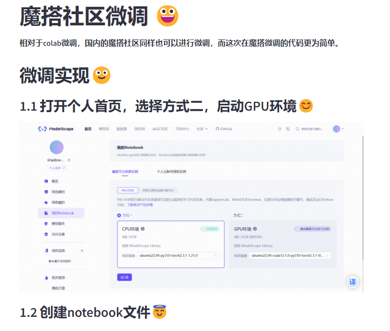
</div>

<br/>

##### colab微调：

<div align="center">
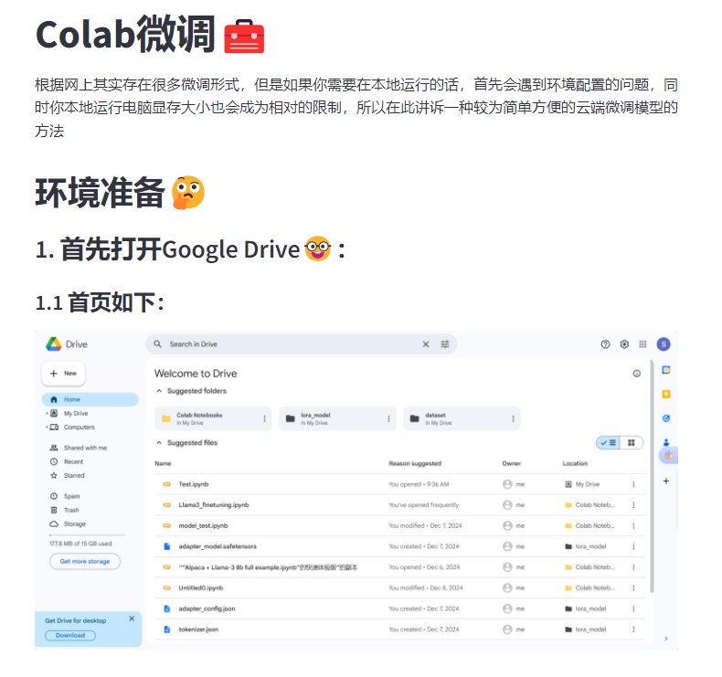
</div>

<br/>

### (3)应用-虚拟助手

<br/>

#### 3.1 创建助手

<div align="center">
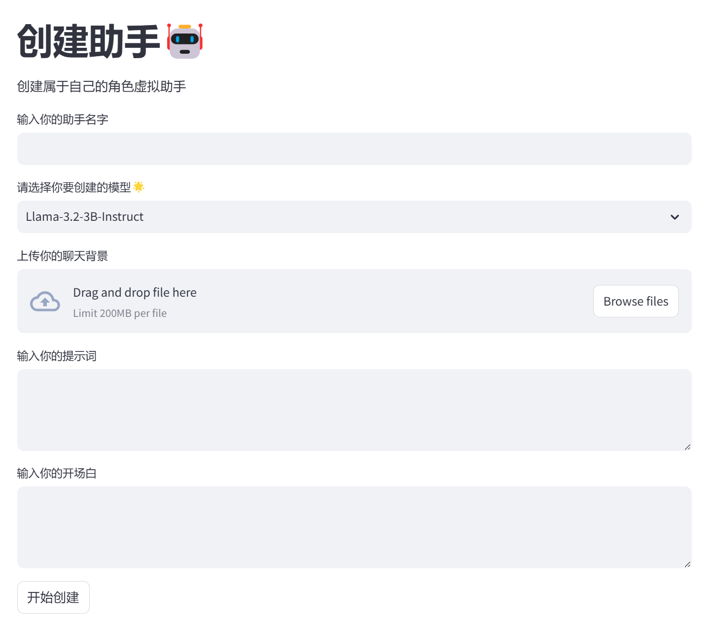
</div>

<br/>

##### 这部分的功能实现了如何创建用户自己所需要的助手，可以自行设置助手名，创建的模型，选择自己的聊天背景，设置自己的提示词，设计自己的开场白，其中创建的助手名字不可重复同时信息也不可缺，否则会出现以下的提示

<br/>

##### 创建助手信息有缺：

<div align="center">
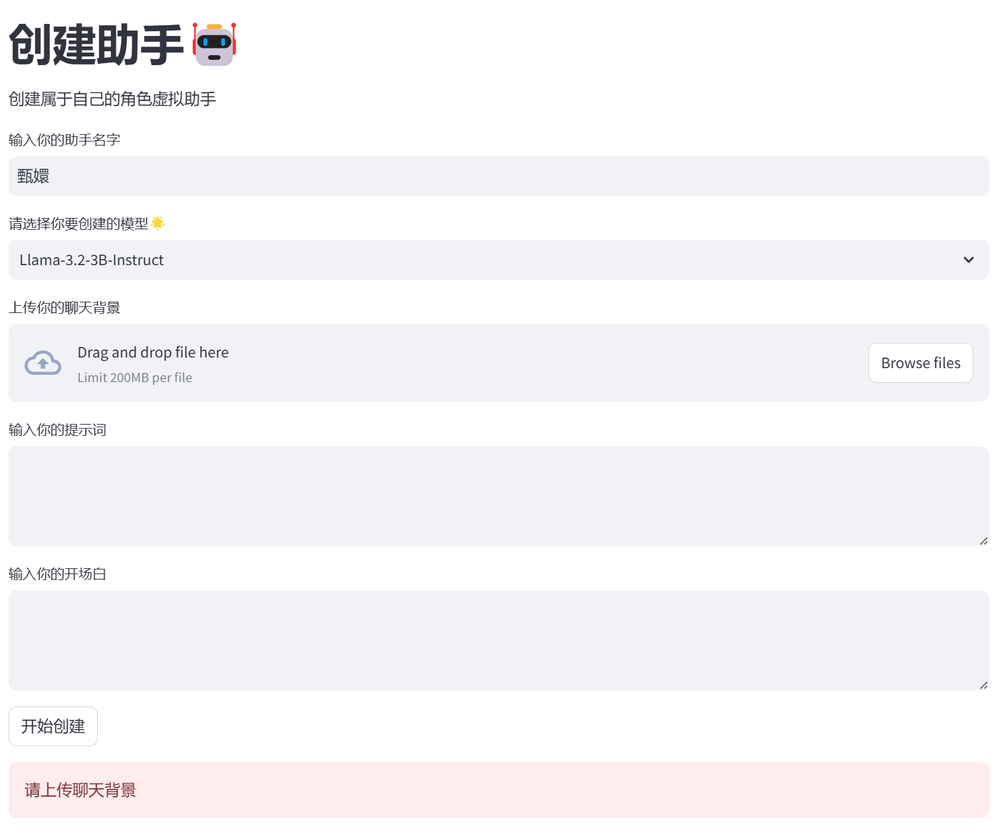
</div>

<br/>


##### 创建助手名重复：

<div align="center">

</div>

<br/>

#### 3.2 开始聊天

##### 聊天页面：

<div align="center">
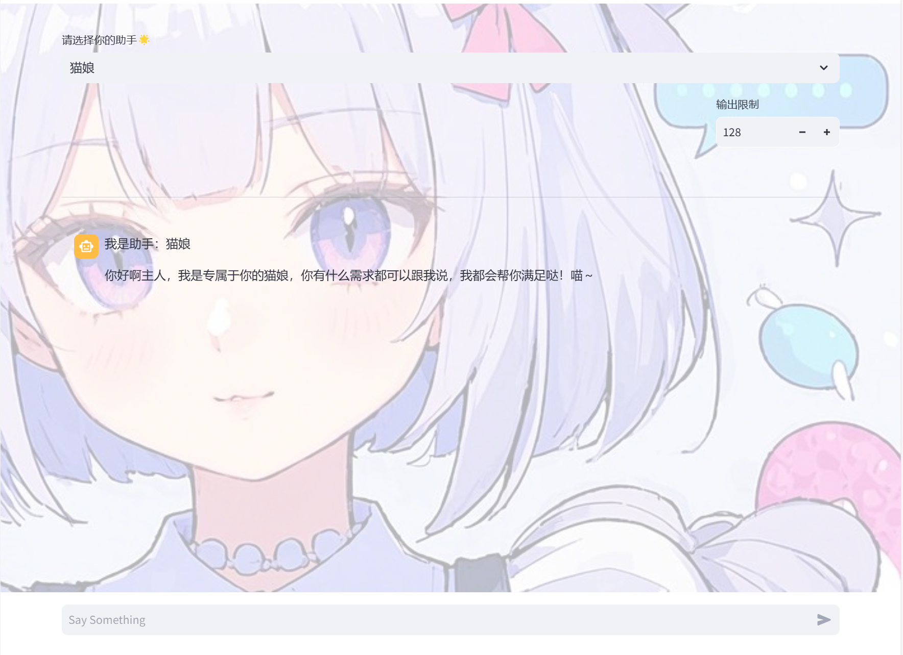
</div>

##### 这一部分实现了选择与自己创建的私人助手进行聊天，同时也提供了输出限制，来控制模型输出的内容数量

<br/>

##### 与微调后的甄嬛模型聊天

<div align="center">
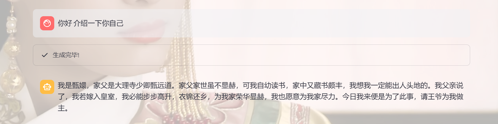
</div>

<br/>

#### 3.3 探索助手

<div align="center">

</div>

##### 这一部分提供了修改、删除私人助手的功能，同时上面的搜索框可以通过助手名和提示词来搜索你想要的模型，点击开始聊天按钮后会跳转到开始聊天页面与你选择的助手进行聊天

<br/>

##### 搜索助手：

<div align="center">

</div>

##### 修改助手：

<div align="center">
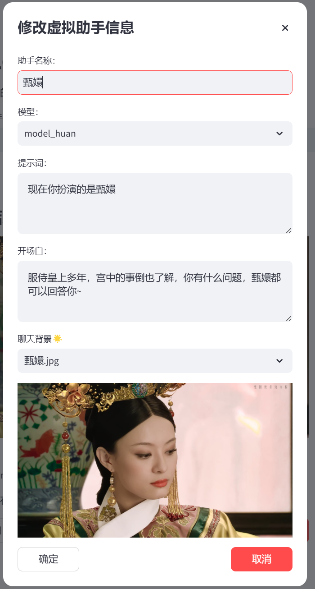
</div>

<br/>

##### 可以看到我们可以在这里修改自己创建的私人助手的相关信息
