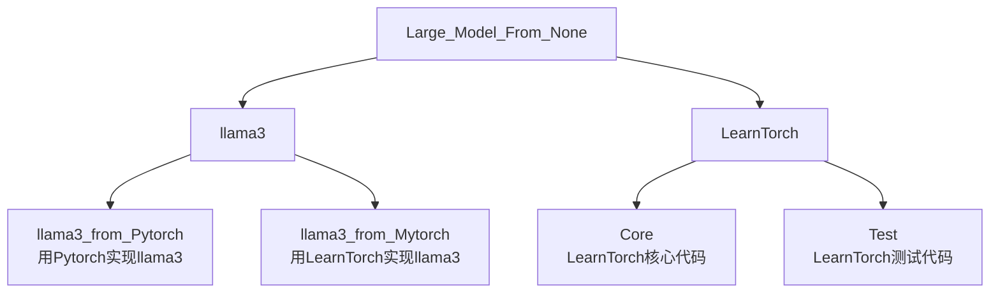

# 项目介绍


我们要实现的最终项目如下图所示：


<!-- 
```
Large_Model_From_None
    ├─llama3
        ├─llama3_from_Pytorch    #用Pytorch实现llama3
        ├─llama3_from_LearnTorch    #用LearnTorch实现llama3
    └─LearnTorch
        ├─Core                  #LearnTorch核心代码
        ├─Test                  #LearnTorch测试代码
```
-->


