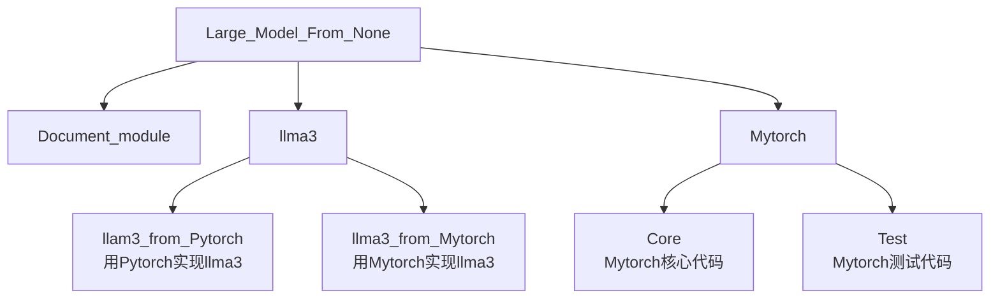

# 项目介绍


我们要实现的最终项目如下图所示：


<!-- 
```
Large_Model_From_None
    ├─Document_module
    ├─llma3
        ├─llam3_from_Pytorch    #用Pytorch实现llma3
        ├─llma3_from_Mytorch    #用Mytorch实现llma3
    └─Mytorch
        ├─Core                  #Mytorch核心代码
        ├─Test                  #Mytorch测试代码
```
-->

