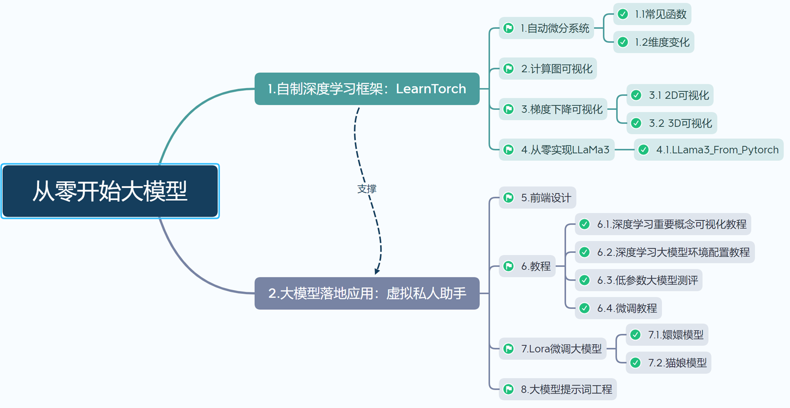

# 从零实现大模型/Large_Model_From_None

## 0.项目介绍/Intro  
我们要实现的最终项目如下图所示：



<!-- 
```
Large_Model_From_None
    ├─llama3
        ├─llama3_from_Pytorch    #用Pytorch实现llama3
        ├─llama3_from_LearnTorch    #用LearnTorch实现llama3
    └─LearnTorch
        ├─Core                  #LearnTorch核心代码
        ├─Test                  #LearnTorch测试代码
```
-->


## 1.自制深度学习框架/LearnTorch  
<br/><br/><br/><br/>
<div align=center>

</div><br/><br/><br/>

### (1)自动微分

<div align="center">
        
        
</div>

### (2)可视化计算图


### (2)可视化学习率和迭代次数
#### (2.1)优化慢


#### (2.2)优化速度快


#### (2.3)反复震荡


### (3)可视化梯度下降
#### (3.1) 梯度下降优化对比牛顿法优化


#### (3.2)线性回归梯度下降优化可视化
<div align="center">

</div>

<div align="center">

</div>

#### (3.3)神经网络线性回归梯度下降优化可视化
##### (3.3.1)欠拟合

<div align="center">

</div>

##### (3.3.2)良好拟合

<div align="center">

</div>

##### (3.3.3)过拟合

<div align="center">

</div>


## 2.虚拟私人助手/VirtualAssistant  

### (0)首页
<br/>

<div align="center">

</div>

### (1)计算图可视化
<br/>

<div align="center">

</div>

