# Colab微调🤖

根据网上其实存在很多微调形式，但是如果你需要在本地运行的话，首先会遇到环境配置的问题，同时你本地运行电脑显存大小也会成为相对的限制，所以在此讲诉一种较为简单方便的云端微调模型的方法

## 环境准备🤔

### 1. 首先打开Google Drive🤓：

#### 1.1 首页如下：

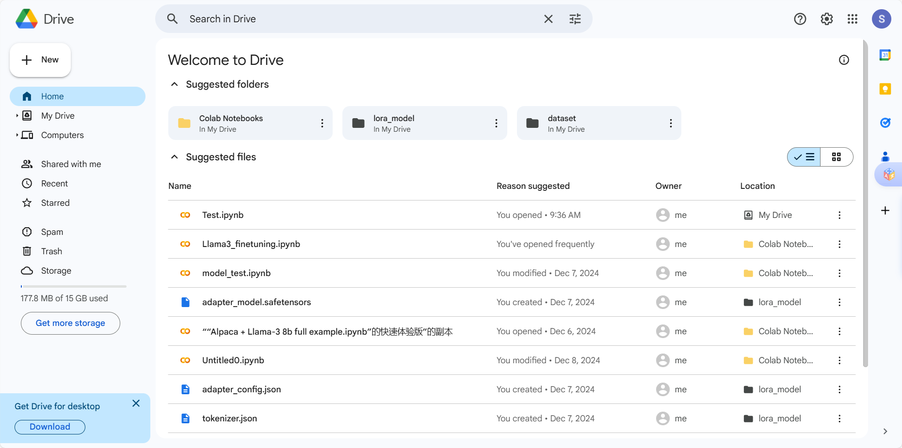

#### 1.2 在右上角有一个创建文件的按钮


### 2. 然后让我们创建一个 **Jupyter Notebook**文件😀：

#### 2.1 按照灰框点击创建**Colab**文件，然后打开文件


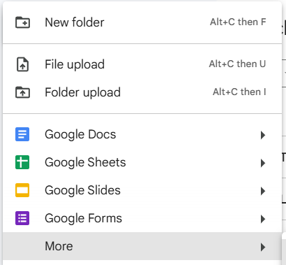

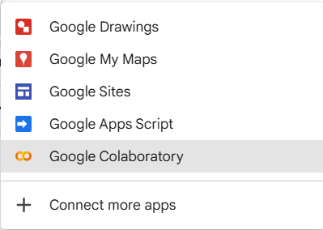

#### 2.2 创建的文件页面如下：

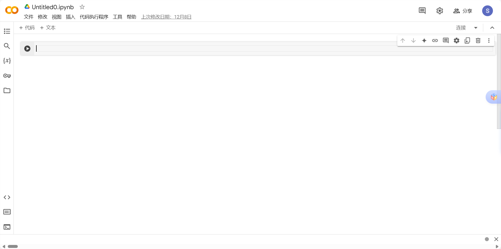

#### 2.3 单击Untitled0.ipynb即可进行改名：


### 3. 将cpu更改为gpu😋：

#### 3.1 点击**代码执行程序**，然后**更改运行时类型**

​	

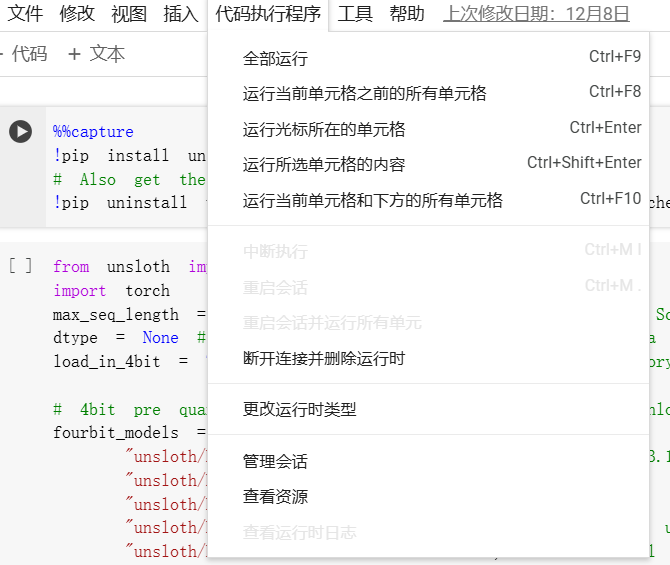

#### 3.2 打开后出现以下界面，选择**T4 GPU**，点击保存

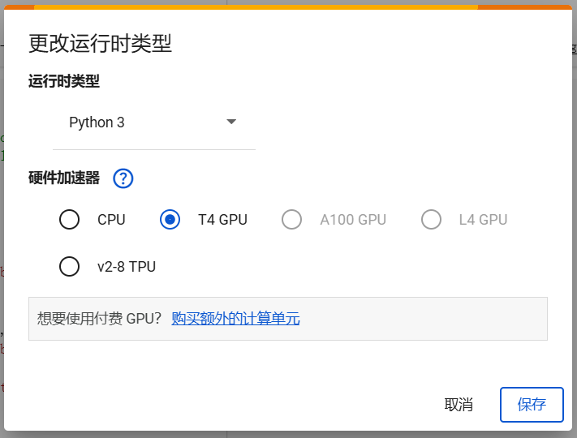

#### 3.3 点击保存后点击右上角**连接T4**进行gpu连接


#### 3.4 出现以下显示即表示连接成功

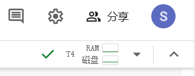

##  模型微调🤓

### 1. 代码执行教程🤩

	#### 1.1 点击**+ 代码**进行添加


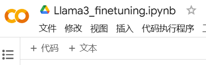

#### 1.2 （提示）出现**绿色勾**就代表执行完成，以下代码全是再执行完上一步后进行下一步的操作


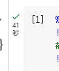

#### 1.3 首先下载最新的`Unsloth`库，点击左侧的**运行按钮**，以下代码全部按照点击左侧运行按钮执行 😶‍🌫️

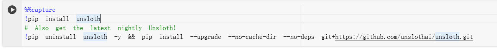

```
%%capture
!pip install unsloth
# Also get the latest nightly Unsloth!
!pip uninstall unsloth -y && pip install --upgrade --no-cache-dir --no-deps git+https://github.com/unslothai/unsloth.git
```

​	

#### 1.4 通过 `Unsloth`库加载基于 Llama 3.1 等模型的量化版本😮‍💨

```
from unsloth import FastLanguageModel
import torch

# 设置模型支持的最大序列长度，2048 表示支持长文本处理
max_seq_length = 2048  

# 数据类型设置。None 表示自动检测。
# Tesla T4、V100 等可以用 Float16，Ampere 架构（如 A100）推荐使用 Bfloat16
dtype = None  

# 是否使用 4bit 量化加载。True 表示启用，可以大幅减少内存占用
load_in_4bit = True  

# 支持的 4bit 预量化模型列表（直接在 Hugging Face 上可用）
fourbit_models = [
    "unslo./meta-Llama-3.1-8B-bnb-4bit",      # Llama-3.1 8B 参数模型（量化后 2 倍速度提升）
    "unslo./meta-Llama-3.1-8B-Instruct-bnb-4bit", # 指令微调版本
    "unslo./meta-Llama-3.1-70B-bnb-4bit",     # Llama-3.1 70B 参数模型
    "unslo./meta-Llama-3.1-405B-bnb-4bit",    # Llama-3.1 超大模型（405B 参数）
    "unslo./mistral-Nemo-Base-2407-bnb-4bit", # Mistral 12B 参数模型，速度更快
    "unslo./mistral-Nemo-Instruct-2407-bnb-4bit", # Mistral 指令微调版本
    "unslo./mistral-7b-v0.3-bnb-4bit",        # Mistral 7B 参数，v3 版本
    "unslo./mistral-7b-instruct-v0.3-bnb-4bit", # Mistral 7B 指令微调版本
    "unsloth/Phi-3.5-mini-instruct",           # Phi-3.5 小型指令微调版本
    "unsloth/Phi-3-medium-4k-instruct",        # Phi-3 中型指令版本，支持 4k 长度
    "unsloth/gemma-2-9b-bnb-4bit",             # Gemma 2 9B 参数模型
    "unsloth/gemma-2-27b-bnb-4bit",            # Gemma 2 27B 参数模型，速度提升
] 
# 更多模型信息可参考 https://huggingface.co/unsloth

# 加载预训练模型和分词器
model, tokenizer = FastLanguageModel.from_pretrained(
	# 指定要加载的模型名称，可以根据需求选择自己需要的模型，除以上列表的模型外，还有很多种模型可以进行训练
    model_name = "unslo./meta-Llama-3.1-8B",  
    max_seq_length = max_seq_length,          # 最大序列长度设置
    dtype = dtype,                            # 数据类型（自动或手动选择）
    load_in_4bit = load_in_4bit,              # 启用 4bit 量化加载
    # token = "hf_...", # 如果加载的是需要授权的模型，需提供 Hugging Face 令牌
)

```


​	如下即基础模型下载完成

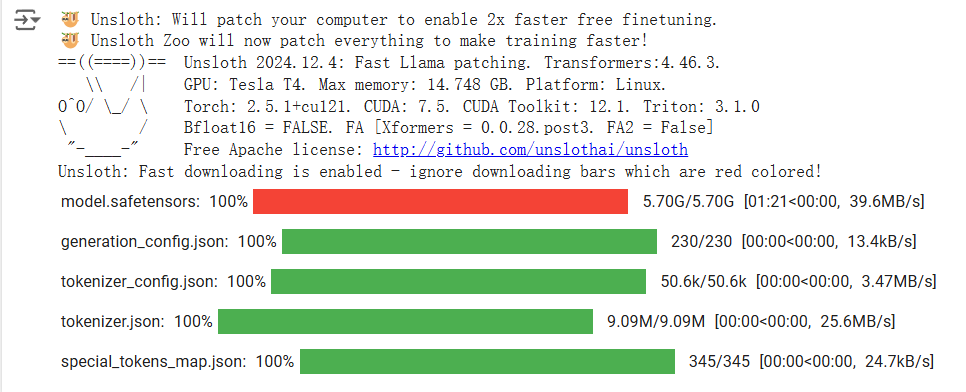

#### 1.5 这段代码使用 `FastLanguageModel` 的 `get_peft_model` 方法来为基础模型添加 **PEFT (Parameter-Efficient Fine-Tuning)** 支持。PEFT 是一种轻量化微调技术，通过引入低秩近似（如 LoRA）和优化技巧来降低微调大语言模型的计算成本和显存需求🤩

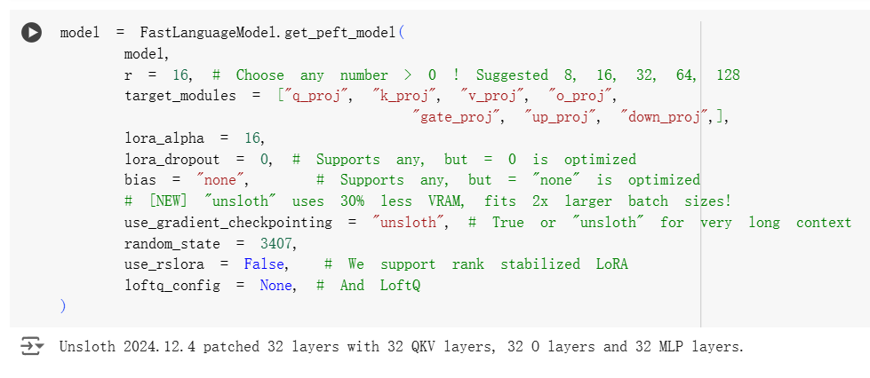

```
model = FastLanguageModel.get_peft_model(
    model,
    r = 16, # LoRA 的秩(rank)。建议值为 8, 16, 32, 64, 128，可以调节以平衡性能和资源占用
    target_modules = ["q_proj", "k_proj", "v_proj", "o_proj",
                      "gate_proj", "up_proj", "down_proj",],
    # 目标模块：指定需要应用 LoRA 的模块，如注意力层 (q_proj, k_proj, v_proj 等)
    
    lora_alpha = 16, # LoRA 的缩放因子 (alpha)，控制 LoRA 的权重对模型的影响
    lora_dropout = 0, # LoRA 的 dropout 概率。0 表示不使用 dropout，优化性能
    bias = "none",    # 指定是否对模型添加偏置项。"none" 表示不添加，优化性能
    
    # [新功能] "unsloth" 优化：显存使用降低 30%，支持 2 倍更大的批次大小
    use_gradient_checkpointing = "unsloth", # 启用梯度检查点，用于节省显存
                                            # 支持 True 或 "unsloth"，适合超长上下文
    random_state = 3407, # 设置随机种子，用于结果复现
    
    use_rslora = False,  # 是否使用 rank stabilized LoRA（秩稳定化 LoRA），默认不启用
    loftq_config = None, # 可选的 LoftQ 配置（用于进一步优化量化）
)

```

​	

#### 1.6 这段代码主要用于将一个 JSON 数据集格式化为模型训练或推理时所需的统一输入格式。通过使用 Alpaca 风格的指令式模板，结合每个样本的 `instruction`（指令）、`input`（上下文输入）和 `output`（期望的响应），生成适合模型处理的文本。同时，挂载 Google Drive 以便访问存储的数据集文件🙃

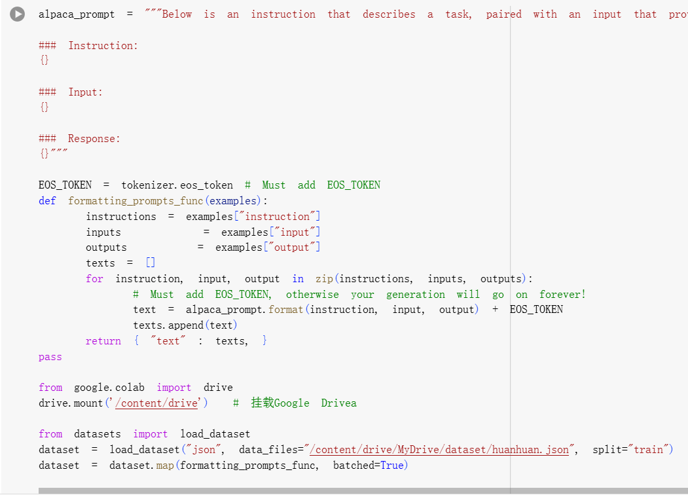

```
# 定义任务模板，用于将指令、输入和响应格式化为完整的提示文本
alpaca_prompt = """Below is an instruction that describes a task, paired with an input that provides further context. Write a response that appropriately completes the request. 

### Instruction:
{}

### Input:
{}

### Response:
{}"""

# 定义终止符（EOS_TOKEN），用于标志生成的结束
EOS_TOKEN = tokenizer.eos_token # 必须添加 EOS_TOKEN，否则生成可能会无限进行

# 定义格式化函数，将每个样本的指令、输入和输出格式化为统一的模板
def formatting_prompts_func(examples):
    instructions = examples["instruction"]  # 提取指令部分
    inputs       = examples["input"]        # 提取输入部分
    outputs      = examples["output"]       # 提取输出部分
    texts = []  # 用于存储格式化后的文本

    # 遍历每个样本，格式化为 alpaca_prompt 模板，并添加终止符
    for instruction, input, output in zip(instructions, inputs, outputs):
        text = alpaca_prompt.format(instruction, input, output) + EOS_TOKEN
        texts.append(text)
    
    # 返回一个字典，其中键为 "text"，值为格式化后的文本列表
    return { "text" : texts, }
pass

# 挂载 Google Drive，以便访问存储在 Drive 中的文件
from google.colab import drive
drive.mount('/content/drive')  # 挂载Google Drive

# 使用 Hugging Face 的 Datasets 加载 JSON 格式的数据集
from datasets import load_dataset
dataset = load_dataset(
    "json", 
    data_files="/content/dri./myDrive/dataset/huanhuan.json", 
    split="train"  # 加载训练集
)

# 对数据集进行格式化，调用 formatting_prompts_func 函数处理每个样本
dataset = dataset.map(formatting_prompts_func, batched=True)

```


#### 1.7 这段代码使用 **SFTTrainer** 和 Hugging Face 的 **TrainingArguments** 配置微调大语言模型 (SFT, Supervised Fine-Tuning)。微调的目标是通过预定义数据集（`dataset`）和配置选项，优化模型的表现😇

```
from trl import SFTTrainer
from transformers import TrainingArguments
from unsloth import is_bfloat16_supported

# 使用 SFTTrainer 进行监督微调
trainer = SFTTrainer(
    model = model,  # 基础模型
    tokenizer = tokenizer,  # 模型的分词器
    train_dataset = dataset,  # 训练数据集
    dataset_text_field = "text",  # 数据集中存储文本的字段名
    max_seq_length = max_seq_length,  # 最大序列长度
    dataset_num_proc = 2,  # 数据预处理时使用的进程数量
    packing = False,  # 是否启用序列打包（短序列合并为长序列以提高效率）
    args = TrainingArguments(  # 训练配置参数
        per_device_train_batch_size = 2,  # 每块 GPU/TPU 的批量大小
        gradient_accumulation_steps = 4,  # 梯度累积步数
        warmup_steps = 5,  # 学习率预热步数
        # num_train_epochs = 1,  # 设置训练轮数（注释掉表示使用 max_steps）
        max_steps = 60,  # 最大训练步数
        learning_rate = 2e-4,  # 学习率
        fp16 = not is_bfloat16_supported(),  # 如果不支持 BF16，则启用 FP16
        bf16 = is_bfloat16_supported(),  # 如果支持 BF16，则启用 BF16
        logging_steps = 1,  # 日志记录的步数间隔
        optim = "adamw_8bit",  # 使用 8-bit AdamW 优化器
        weight_decay = 0.01,  # 权重衰减系数
        lr_scheduler_type = "linear",  # 学习率调度策略（线性衰减）
        seed = 3407,  # 随机种子，用于结果复现
        output_dir = "outputs",  # 输出目录
        report_to = "none",  # 日志上报工具（如 WandB），设置为 none 表示禁用
    ),
)

```


#### 1.8 这段代码用于显示当前 GPU 的内存统计信息，帮助用户了解设备的内存情况，包括总显存大小和当前已预留的显存大小。

```
# 获取 GPU 设备属性
gpu_stats = torch.cuda.get_device_properties(0)  # 获取第一个 GPU 的属性信息
# 获取当前程序已预留的显存大小，并转换为 GB
start_gpu_memory = round(torch.cuda.max_memory_reserved() / 1024 / 1024 / 1024, 3)  
# 获取 GPU 的总显存大小，并转换为 GB
max_memory = round(gpu_stats.total_memory / 1024 / 1024 / 1024, 3)  

# 打印 GPU 信息
print(f"GPU = {gpu_stats.name}. Max memory = {max_memory} GB.")  # 输出 GPU 名称和总显存大小
print(f"{start_gpu_memory} GB of memory reserved.")  # 输出当前程序预留的显存大小

```

​	

#### 1.9 模型训练😉

```
trainer_stats = trainer.train()
```

​	

​	如界面显示就是在训练过程之中会进行60步的训练，这个参数可以对1.7步骤中的**max_steps**进行修改

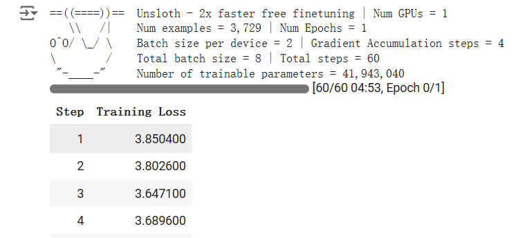

#### 1.10 训练完成之后可以统计和显示训练过程中的内存使用情况以及所花费的时间，为调试和优化提供参考。

```
# 显示最终的内存和时间统计信息
used_memory = round(torch.cuda.max_memory_reserved() / 1024 / 1024 / 1024, 3)  # 获取GPU训练过程中最大保留的内存（以GB为单位）
used_memory_for_lora = round(used_memory - start_gpu_memory, 3)  # 计算LoRA训练占用的内存
used_percentage = round(used_memory / max_memory * 100, 3)  # 计算占用的内存相对于最大可用内存的百分比
lora_percentage = round(used_memory_for_lora / max_memory * 100, 3)  # LoRA训练内存占用的百分比

# 输出训练时间统计信息
print(f"{trainer_stats.metrics['train_runtime']} seconds used for training.")  # 打印训练总时间（秒）
print(f"{round(trainer_stats.metrics['train_runtime'] / 60, 2)} minutes used for training.")  # 打印训练总时间（分钟）

# 输出内存使用统计信息
print(f"Peak reserved memory = {used_memory} GB.")  # 打印训练过程中的峰值内存使用量
print(f"Peak reserved memory for training = {used_memory_for_lora} GB.")  # 打印用于训练的峰值内存使用量
print(f"Peak reserved memory % of max memory = {used_percentage} %.")  # 打印峰值内存使用量相对于最大内存的百分比
print(f"Peak reserved memory for training % of max memory = {lora_percentage} %.")  # 打印用于训练的峰值内存使用量相对于最大内存的百分比

```


#### 1.11 通过定义任务模板和使用生成模型，实现了自然语言问题的动态生成与实时输出功能，适用于自然语言处理任务中的对话生成、文本补全或任务指令执行。同时，通过 GPU 加速和流式输出工具优化了推理速度与交互体验🫠

##### 通过输出的结果显示训练的效果。

```
# alpaca_prompt = 从上面复制的模板
FastLanguageModel.for_inference(model)  # 启用模型的原生推理模式，提升推理速度（2倍）

# 使用tokenizer对输入进行编码
inputs = tokenizer(
    [
        alpaca_prompt.format(
            "嬛妹妹，刚刚我去府上请脉，听甄伯母说你来这里进香了。",  # 指令部分，填写你要输入的自然语言问题
            "",  # 输入部分，这里留空
            "",  # 输出部分，留空以便生成新的内容
        )
    ], 
    return_tensors="pt"  # 将输入转换为PyTorch张量
).to("cuda")  # 将编码后的张量移动到GPU

# 从transformers库导入TextStreamer
from transformers import TextStreamer
text_streamer = TextStreamer(tokenizer)  # 创建一个文本流式输出的工具

# 调用模型的generate方法生成文本
_ = model.generate(
    **inputs,  # 输入张量
    streamer=text_streamer,  # 使用TextStreamer流式输出生成的文本
    max_new_tokens=128  # 限制生成的最大新词数为128
)
```

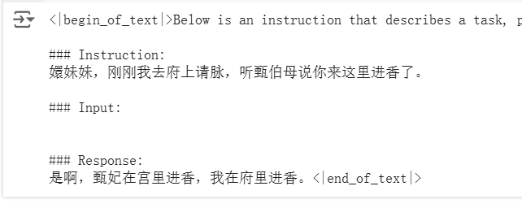

#### 1.12 保存模型权重以及分词器 （推荐保存在云盘之中，在挂载云盘后保存权重以及分词器，后续可以进行下载，从而转为本地运行微调后的模型）😁

```
model.save_pretrained("/content/dri./myDrive/lora_model") # 云盘保存
tokenizer.save_pretrained("/content/dri./myDrive/lora_model")
# model.push_to_hub("your_name/lora_model", token = "...") 
# tokenizer.push_to_hub("your_name/lora_model", token = "...") # 保存到hugging face
```


#### 1.13 如果你希望反复进行问答，只需要反复运行你以下提问的内容即可，然后就可以进行多次微调后的回答😄

```
inputs = tokenizer(
[
    alpaca_prompt.format(
        "皇上吉祥！", # instruction
        "", # input
        "", # output - leave this blank for generation!
    )
], return_tensors = "pt").to("cuda")

from transformers import TextStreamer
text_streamer = TextStreamer(tokenizer)
_ = model.generate(**inputs, streamer = text_streamer, max_new_tokens = 128)
```


###  2. 使用微调后的模型🤪

​	**如果你想要运行微调权重后的模型，那么创建一个新文件，执行以下的代码，如此不需要像上一个文件一样进行训练，可以直接进行问答**

#### 2.1 导入运行所需要的库

```
%%capture
!pip install unsloth
# Also get the latest nightly Unsloth!
!pip uninstall unsloth -y && pip install --upgrade --no-cache-dir --no-deps git+https://github.com/unslothai/unsloth.git
```


#### 2.2 挂载云盘

```
from google.colab import drive
drive.mount('/content/drive')
```


#### 2.3 在预量化的 4bit 模型基础上使用微调的权重

```
from unsloth import FastLanguageModel
import torch

from trl import SFTTrainer
from transformers import TrainingArguments

# 定义最大序列长度，支持 RoPE（旋转位置编码）扩展以处理更长的序列
max_seq_length = 2048  # 可自定义任何值，内部自动支持 RoPE 扩展
# 设置数据类型，None 为自动检测，Tesla T4/V100 使用 Float16，Ampere+ 使用 Bfloat16
dtype = None
# 启用 4bit 量化以减少内存占用，也可以设为 False 不使用量化
load_in_4bit = True  

# 加载指定的预训练模型，支持 Hugging Face Hub
model, tokenizer = FastLanguageModel.from_pretrained(
    model_name="unsloth/Llama-3.2-3B-Instruct",  # 模型名称
    max_seq_length=max_seq_length,  # 最大序列长度
    dtype=dtype,  # 数据类型
    load_in_4bit=load_in_4bit,  # 是否启用 4bit 量化
    # token="hf_...",  # 如果加载需要权限的模型，可指定 Hugging Face 的访问令牌
)

# 加载本地保存的 LoRA 微调模型
if True:
    from unsloth import FastLanguageModel
    model, tokenizer = FastLanguageModel.from_pretrained(
        model_name="/content/dri./myDrive/lora_model",  # 微调模型的路径
        max_seq_length=max_seq_length,  # 最大序列长度
        dtype=dtype,  # 数据类型
        load_in_4bit=load_in_4bit,  # 是否启用 4bit 量化
    )
    FastLanguageModel.for_inference(model)  # 启用推理加速，推理速度提升 2 倍

alpaca_prompt = """Below is an instruction that describes a task, paired with an input that provides further context. Write a response that appropriately completes the request.

### Instruction:
{}

### Input:
{}

### Response:
{}"""

```

​	

#### 2.4 修改一下输入，进行运行就会产生回答

```
inputs = tokenizer(
[
    alpaca_prompt.format(
        "皇上吉祥", # instruction
        "", # input
        "", # output - leave this blank for generation!
    )
], return_tensors = "pt").to("cuda")

from transformers import TextStreamer
text_streamer = TextStreamer(tokenizer)
_ = model.generate(**inputs, streamer = text_streamer, max_new_tokens = 128)
```


##### 以下就是通过微调后产生的回答：

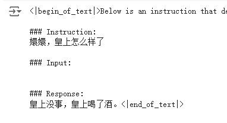

##  微调数据集🫡

**一开始准备数据集，可以使用网上已经收集好的微调数据集来进行训练，试试手，后续再通过选择自己喜欢的内容来制作数据集进行微调，为了方便准备数据集，在dataset文件夹提供几个合适的json文件数据集。**😏


#### 3.1 首先，我们需要准备《甄嬛传》剧本数据，这里我们使用了《甄嬛传》剧本数据，我们可以查看一下原始数据的格式。

> 第2幕
> （退朝，百官散去）
> 官员甲：咱们皇上可真是器重年将军和隆科多大人。
> 官员乙：隆科多大人，恭喜恭喜啊！您可是国家的大功臣啊！
> 官员丙：年大将军，皇上对你可是垂青有加呀！
> 官员丁：年大人，您可是皇上的股肱之臣哪！
> 苏培盛（追上年羹尧）：年大将军请留步。大将军——
> 年羹尧：苏公公，有何指教？
> 苏培盛：不敢。皇上惦记大将军您的臂伤，特让奴才将这秘制的金创药膏交给大人，叫您使用。
> 年羹尧（遥向金銮殿拱手）：臣年羹尧恭谢皇上圣恩！敢问苏公公，小妹今日在宫中可好啊？
> 苏培盛：华妃娘娘凤仪万千、宠冠六宫啊，大将军您放心好了。
> 年羹尧：那就有劳苏公公了。（转身离去）
> 苏培盛：应该的。


#### 3.2 每一句都有人物及对应的台词，所以就可以很简单的将这些数据处理成对话的形式，如下：

> [
>  {"rloe":"官员甲", "content":"咱们皇上可真是器重年将军和隆科多大人。"},
>  {"rloe":"官员乙", "content":"隆科多大人，恭喜恭喜啊！您可是国家的大功臣啊！"},
>  {"rloe":"官员丙", "content":"年大将军，皇上对你可是垂青有加呀！"},
>  {"rloe":"官员丁", "content":"年大人，您可是皇上的股肱之臣哪！"},
>  {"rloe":"苏培盛", "content":"年大将军请留步。大将军——"},
>  ...
> ]


#### 3.3 然后再将我们关注的角色的对话提取出来，形成 QA 问答对。对于这样的数据，我们可以使用正则表达式或者其他方法进行快速的提取，并抽取出我们关注的角色的对话。

#### 最后再将其整理成 `json` 格式的数据，如下：

```
[
    {
        "instruction": "小姐，别的秀女都在求中选，唯有咱们小姐想被撂牌子，菩萨一定记得真真儿的——",
        "input": "",
        "output": "嘘——都说许愿说破是不灵的。"
    },
    {
        "instruction": "这个温太医啊，也是古怪，谁不知太医不得皇命不能为皇族以外的人请脉诊病，他倒好，十天半月便往咱们府里跑。",
        "input": "",
        "output": "你们俩话太多了，我该和温太医要一剂药，好好治治你们。"
    },
    {
        "instruction": "嬛妹妹，刚刚我去府上请脉，听甄伯母说你来这里进香了。",
        "input": "",
        "output": "出来走走，也是散心。"
    }
]
```


#### 所以，在这一步处理数据的大致思路就是😌：

***1. 从原始数据中提取出角色和对话  2. 筛选出我们关注的角色的对话  3. 将对话转换成我们需要的格式***

> *这一步也可以增加数据增强的环节，比如利用两到三条数据作为 example 丢给LLM，让其生成风格类似的数据。再或者也可以找一部分日常对话的数据集，使用 RAG 生成一些固定角色风格的对话数据。这里大家可以完全放开的大胆去尝试！*

